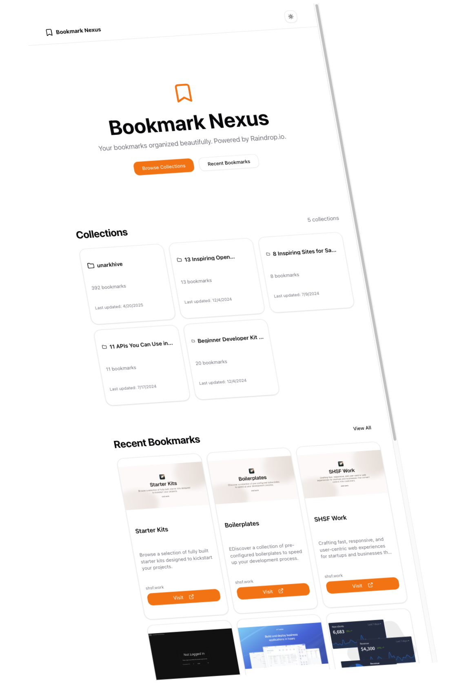

# Bookmark Nexus

A sleek, modern bookmark manager powered by Raindrop.io API and built with Next.js 15 (App Router), TypeScript, Tailwind CSS, and ShadCN UI components.



## Features

- 📚 View all collections and bookmarks from your Raindrop.io account
- 🌓 Dark/Light mode toggle
- 🔥 Modern UI with ShadCN UI components
- 📱 Fully responsive design
- 🔄 Auto-refreshes data hourly

## Getting Started

### Prerequisites

- Node.js 18+
- A Raindrop.io account and API token

### Installation

1. Clone the repository:

```bash
git clone https://github.com/yourusername/notion-nextjs-waitlist-starter-kit
cd notion-nextjs-waitlist-starter-kit
```

2. Install dependencies:

```bash
npm install
```

3. Create a `.env.local` file in the root directory with your Raindrop.io API token:

```
RAINDROP_ACCESS_TOKEN=your_token_here
```

### Running the Development Server

```bash
npm run dev
```

Open [http://localhost:3000](http://localhost:3000) with your browser to see the result.

### Building for Production

```bash
npm run build
npm start
```

## How to Get Your Raindrop.io API Token

1. Create a Raindrop account at [raindrop.io](https://raindrop.io) if you don't have one
2. Navigate to the settings by clicking on your user information in the upper-right corner
3. Go to the "Integrations" section
4. Under the "For developers" area, create a new app and generate a test token

## Technologies Used

- [Next.js 15](https://nextjs.org/)
- [TypeScript](https://www.typescriptlang.org/)
- [Tailwind CSS](https://tailwindcss.com/)
- [ShadCN UI](https://ui.shadcn.com/)
- [Raindrop.io API](https://developer.raindrop.io/)

## Contributing

Contributions are welcome! Please feel free to submit a Pull Request.

## License

This project is licensed under the MIT License - see the LICENSE file for details.
